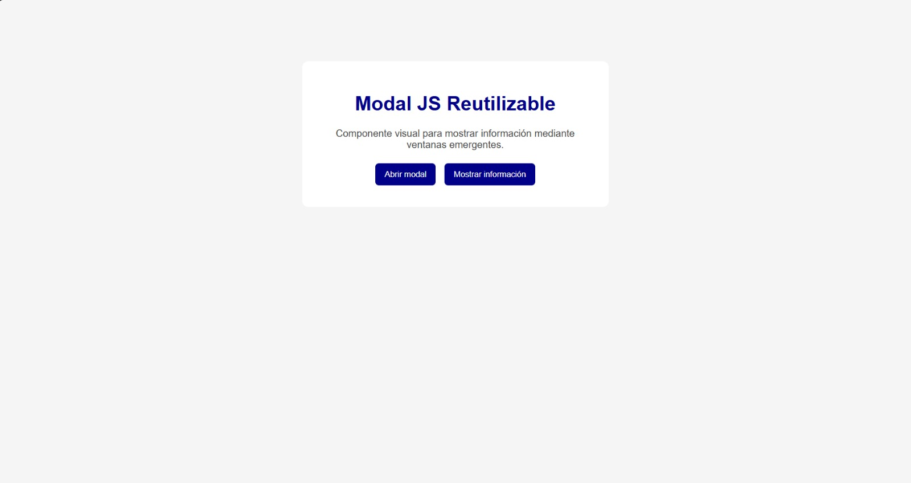
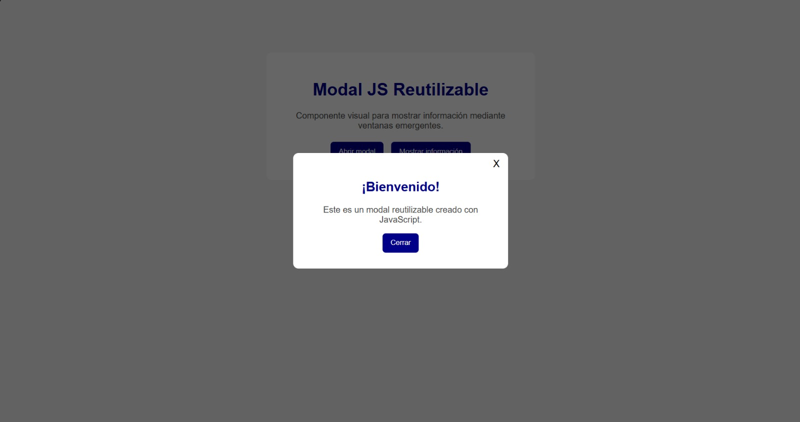

# Modal JS Reutilizable

## Autor

Eduardo Yael Mendoza Martinez

## Descripción
Este proyecto contiene un componente visual de tipo modal creado con HTML, CSS y JavaScript.

El componente permite mostrar diferentes mensajes al usuario mediante una ventana emergente sin tener que crear un modal diferente para cada contenido.

El título y el contenido del modal se pueden cambiar mediante parámetros.
## Instalación
Para utilizar el componente se deben incluir los archivos CSS y JavaScript en el documento HTML.

**Ejemplo:**

```html
<link rel="stylesheet" href="css/componente.css">
<script src="js/componente.js"></script>
## Uso
El modal se puede mostrar utilizando la función `mostrarModal()`.

La función recibe dos parámetros: el título y el contenido que se desea mostrar.

**Ejemplo:**

```html
<button onclick="mostrarModal(
    '¡Bienvenido!',
    'Este es un mensaje de ejemplo.'
)">
    Abrir modal
</button>
mostrarModal(
    "¡Bienvenido!",
    "Este es un mensaje de ejemplo."
);
## Capturas de pantalla



## Video
[Ver video del modal](capturas/videomodal.mp4)